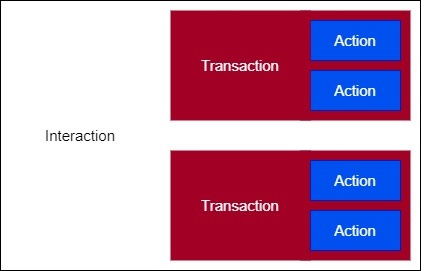

# The Matter Interaction Model

The Matter Device Interaction Model (IM) defines the methods of communication between nodes, and serves as the common language for node-to-node information transmission.

Nodes communicate with each other through interactions. Interactions are a sequence of transaction(s), which in turn are a sequence of actions.

For example, in a Read Interaction, a client cluster can initiate a Read Transaction, where the client can request to read an attribute and a server cluster can respond by reporting the attribute. Both the client request and the server response are separate actions, but they are part of the same Read Transaction, which the Read Interaction encompasses.

The Interaction Model supports four types of interactions:

