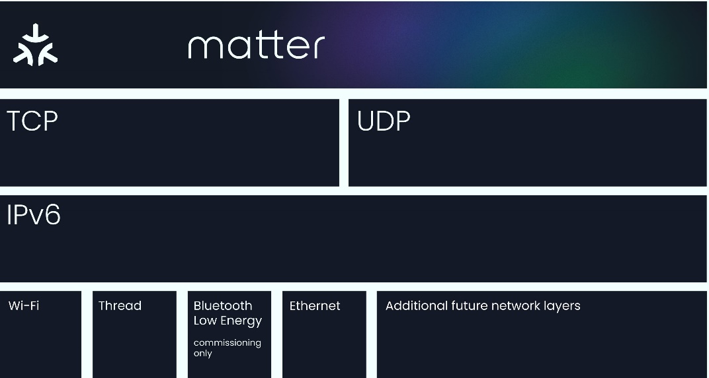

# Introduction to Matter

## Why Matter?

The Connectivity Standards Alliance (CSA) seeks to enable smart home devices to be secure, reliable, and interoperable with other Internet of Things (IoT) devices, regardless of manufacturer. One of the biggest pain points of smart home devices is the various application-layer implementations that limit the compatibility of different smart home devices. Therefore, Matter was adopted so that matter-enabled devices, under the same standard, provide a better experience for both the manufacturers and users.

While Matter was created to make the IoT seamless and effortless for users, it is important to acknowledge the complexity involved under the surface. Matter leverages a range of tools to enable seamless and secure connectivity within an IoT system. Understanding these tools is crucial for a comprehensive overview of this technology.

## Matter Enablement

Matter implements the Application Layer of the Open Systems Interconnection (OSI) model. It builds on the lower layers, such as the transport and network layers, to enable reliable communication between nodes.

Matter may sit on top of two prominent connectivity technologies: Thread and Wi-Fi. Thread is a low-power wireless mesh networking protocol that facilitates reliable communication between nodes. It enables extended coverage and reliable connections to improve the overall performance of IoT ecosystems.

Matter is an IPv6-based protocol that utilizes transport layer protocols like TCP/UDP to facilitate network addressing and reliable transmission of data packets, respectively. Due to this, Matter is compatible with multiple connectivity options (such as Thread and Wi-Fi). This flexibility allows Matter-enabled devices to communicate over various network protocols, ensuring broad compatibility and integration with different networking technologies.

The true power of Matter lies in its commitment to interoperability. Industry leaders such as Google, Apple, Amazon, and Samsung Smart Things have implemented Matter in their IoT devices, fostering wider adoption from other manufacturers. Matter also supports bridging from other existing technologies, such as Zigbee, Bluetooth® Mesh and Z-Wave. This allows already existing IoT technology to be integrated into an interoperable environment. The compatibility and seamless integration across brands create a unified ecosystem where your smart devices work harmoniously.

