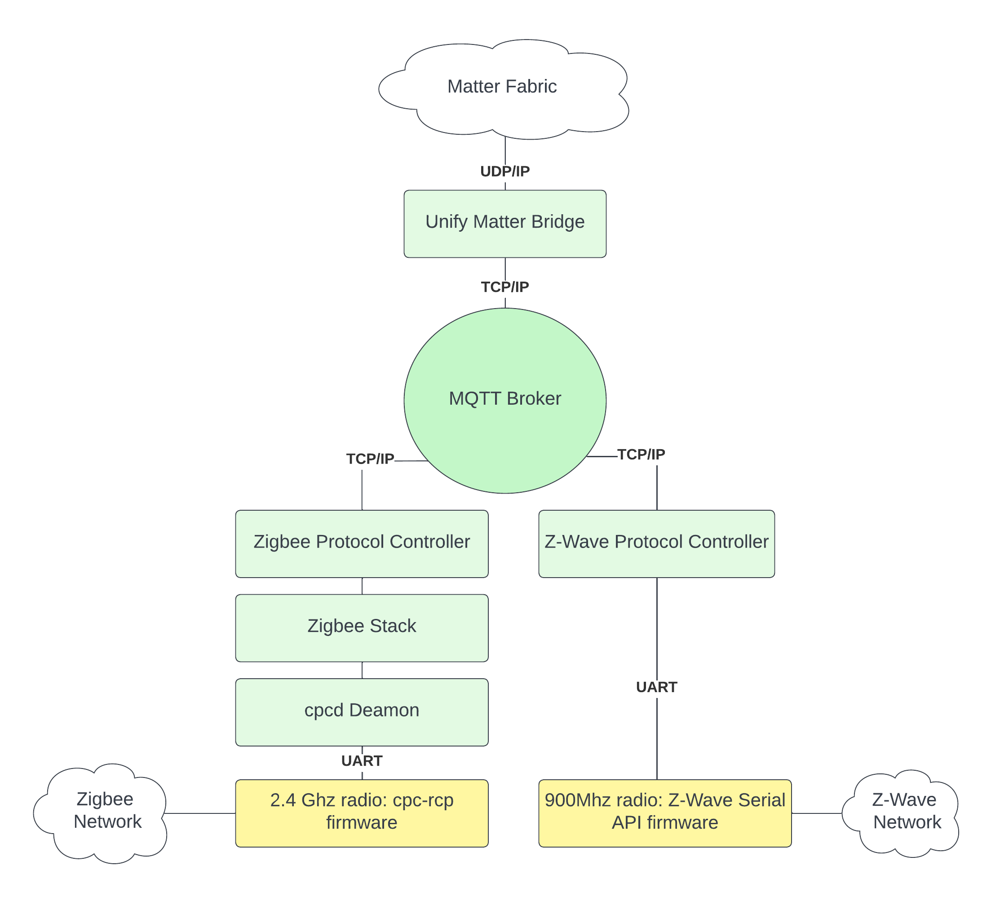

# Unify Matter Bridge Overview

The Unify Matter Bridge is an application that makes legacy devices, such as
Z-Wave and Zigbee devices, accessible on a Matter fabric. It does so by acting
as an _IoT Service_ in a Unify Framework.

In the Unify Framework, _protocol controllers_ translate raw wireless
application protocols such as Z-Wave and Zigbee into a common API called the
Unify Controller Language (UCL). This enables IoT services to operate and
monitor Z-Wave and Zigbee networks without being aware of the underlying
wireless protocol.

In Unify, the transport between IoT services and Protocol Controllers is MQTT
using JSON payloads for data representation.

On the Matter fabric, the Unify Matter Bridge is a Matter device that has
dynamic endpoints, each representing an endpoint on one of the nodes in the
Unify network. See the "Matter Specification" section "9.12. Bridge for
non-Matter devices" for details.

The figure below illustrates the system architecture of the Unify Matter Bridge
and two Unify protocol controllers.

More Information about the Unify Framework can be found
[here](https://siliconlabs.github.io/UnifySDK/doc/UnifySDK.html)

## Trying Out the Unify Matter Bridge using Portable Runtime Environment.

The Unify Portable Runtime Environment strives to get the unify matter bridge running as fast as
possible on your desktop. Prerequisites for bringing up unify matter bridge with portable runtime
are given [here](https://siliconlabs.github.io/UnifySDK/portable_runtime/readme_user_cli.html).

Detailed steps to quick start unify matter bridge using GUI can be found [here](https://siliconlabs.github.io/UnifySDK/portable_runtime/readme_user_gui.html).

Detailed steps to quick start unify matter bridge using cli can be found [here](https://siliconlabs.github.io/UnifySDK/portable_runtime/readme_user_cli.html#Unify-Matter-Bridge-selection).

## Trying Out the Unify Matter Bridge Manually

