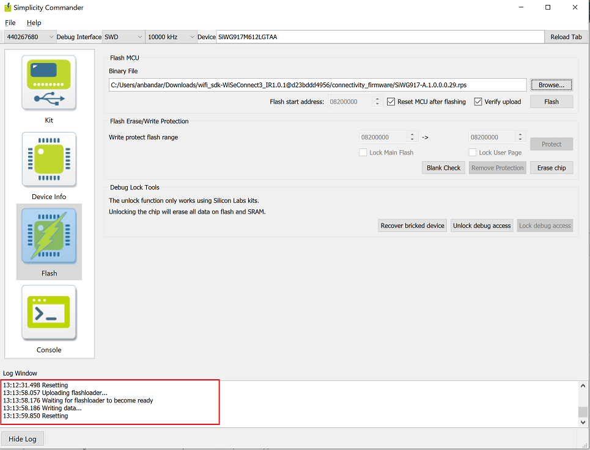

# Getting Started with SoC Mode

This guide describes how to get started developing an application for the SiWx91x in System-on-chip (SoC) mode, where both the application and the networking stack run on the SiWx917 chipset.

## Check Prerequisites

In order to run Matter over Wi-Fi, check for the following prerequisites:

### Hardware Requirements

The following hardware devices are required for executing Matter over Wi-Fi:
- Silicon Labs Wireless starter/development kit (WSTK)
- SiWx917 SoC development kit
- Wi-Fi Dev Kit
- Windows/Linux/MacOS computer with a USB port
- USB cable for connecting WSTK Board to Computer
- Raspberry Pi with a >32 GB SD Card
- Access Point with Internet Access

### Software Requirements

## Connect SiWx917 SOC to Computer

1. Mount the SiWx917 radio board on the SiWx917 WSTK board.
    
   
    
2. Connect your SiWx917 Wireless Starter Kit (WSTK) board to your computer using a USB cable.

### Steps to update the firmware on SiWx917 SoC radio board using Simplicity Commander

1. Open Simplicity Commander application.

3. In the Simplicity Commander window, click Select Kit and choose your radio board.

   

4. In the navigation pane, go to the Flash section.

5. Click Browse next to the Binary File field.
   
   

6. Refer [Firmware for SiWx917 SoC](../general/ARTIFACTS.md#siwx917-firmware-for-siwx917-soc) to identify the which firmware to be flashed into the specific hardware. Locate and select the firmware file to flash.  

7. Click Flash

   

8. The firmware will be flashed and the Log Window will display a "Resetting" message.

   

### Troubleshoot SiWx917 SOC Firmware Update Failure
If the firmware update fails, try the following:
